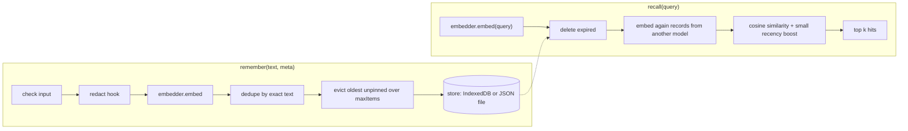
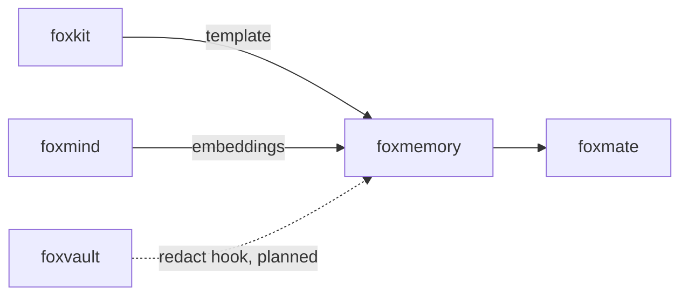

# foxmemory

Local memory for AI agents that the user can read, edit, and delete.

foxmemory stores what an agent learns about a person: facts, preferences and
task notes. It finds them again by meaning, with embeddings from a model on
the same device. Memories stay in IndexedDB in the browser or in a JSON file
in Node. The user can list, change, pin, export and delete each one.

## Install

```bash
npm i foxmemory
```

## Example

This example runs in Node 24 or later. It gets embeddings from a local
Ollama server through [foxmind](https://github.com/pooriaarab/foxmind), so
first run `npm i foxmind` and `ollama pull all-minilm`.

```js
import { createMind, ollama } from "foxmind";
import { createMemory } from "foxmemory";
import { fileStore } from "foxmemory/node";

const memory = createMemory({
  store: fileStore("memories.json"),
  // Memories are private, so the router may use only local models.
  embedder: createMind({ providers: [ollama({ model: "all-minilm" })], only: ["browser", "local"] }),
});

await memory.remember("I take my coffee with oat milk.", { kind: "preference" });
await memory.remember("My sister lives in Vancouver.");
const [hit] = await memory.recall("How do I like my coffee?");
console.log(hit.memory.text, hit.similarity.toFixed(2));
```

Output on our test machine:

```text
I take my coffee with oat milk. 0.57
```

In a Firefox extension page, use `indexedDbStore("memories")` as the store
and foxmind's in-browser model,
`createMind({ providers: [transformers({ task: "embed" })], only: ["browser", "local"] })`.
The demo extension does this. With `only`, foxmind never calls a cloud model,
so no memory text leaves the device through the embedder.

## Use cases

| Who | What they build | How foxmemory helps |
|---|---|---|
| A builder of a personal agent (for example foxmate) | An agent that remembers your diet, your family and your open tasks | `remember` and `recall` find a fact by meaning, and the user can see and delete each one on a Memory page. |
| A note-taking extension developer | Notes that you search in your own words | `recall("what did I save about tax forms?")` ranks notes by meaning. `list({ contains })` filters by text. |
| A support assistant team | A helper that remembers each customer's setup between chats | Each memory has a `source`, such as a conversation id. `forgetWhere({ source })` deletes one customer's memories when they ask. |
| A reader who saves web pages | Local search over saved pages (local RAG) | Store page passages with the page URL as `source`, then `recall` the passages for a question. Nothing goes to a server. |
| Any app that wants user-editable AI memory | A memory that users can trust | `exportAll` gives a JSON file the user can read. `importAll` checks every field before it writes. `redact` removes secrets before they are stored. |
| A command-line agent or script | Memory that lasts between runs | `fileStore` keeps memories in one JSON file, safe for two processes. The `foxmemory` CLI lists, exports and edits that file. |

## How it works



Each record keeps the id of the model that made its vector, and the vector's
size. Recall compares only vectors from the query's model. When the model
changes, recall embeds the old records again in batches before it ranks, and
stores the new vectors, so two vector spaces never mix. Records without a
vector (for example from an import without vectors) get one the same way.

Vectors are stored at unit length, so cosine similarity is one dot product per
memory. Recall reads every memory: there is no index.

```mermaid
sequenceDiagram
  participant A as Memory page A
  participant B as Memory page B
  participant L as Web Locks
  participant DB as IndexedDB
  A->>L: request "foxmemory:demo"
  B->>L: request "foxmemory:demo" (waits)
  A->>DB: read version; reload if changed
  A->>DB: write records, version + 1 (one transaction)
  A-->>L: release
  L-->>B: granted
  B->>DB: version changed, so reload, then dedupe and write
  A-->>B: BroadcastChannel "changed": draw the list again
```

Every write runs under a lock: Web Locks in the browser, a lock file in Node.
A version number changes on every write, so each page or process knows when
its copy is stale.

## API

### `foxmemory`

| Export | What it does |
|---|---|
| `createMemory({ store, embedder, redact?, maxItems?, batchSize?, recencyWeight?, halfLifeMs?, now? })` | Makes a memory. `embedder` is any object with `embed(texts) → { vectors, model }`, for example a foxmind `Mind`. Defaults: `maxItems` 10000, `batchSize` 32, `recencyWeight` 0.05, `halfLifeMs` 30 days. |
| `memory.remember(text, { kind?, source?, pinned?, ttlMs?, expiresAt? })` | Stores one memory. Returns `{ memory, deduped, evicted }`. `kind` is `fact` (default), `preference` or `task-note`. `source` defaults to `user`. |
| `memory.rememberMany(items)` | Stores many in one write. When one embed call fails, it stores none. |
| `memory.recall(query, { k?, kinds?, minScore? })` | The best `k` (default 5) memories: `[{ memory, similarity, score }]`. `minScore` applies to `similarity`. |
| `memory.update(id, { text?, kind?, source?, pinned?, expiresAt? })` | Changes a memory. A new text gets a new vector. `expiresAt: null` removes the expiry. |
| `memory.forget(id)` | Deletes one memory and its vector. Returns `false` when there was none. |
| `memory.forgetWhere({ kinds?, source?, contains?, before?, pinned? })` | Deletes every match and returns the count. An empty filter fails. |
| `memory.clear()` | Deletes every memory. |
| `memory.list({ kinds?, contains? })`, `memory.get(id)` | Reads memories, pinned first, then the newest. |
| `memory.stats()` | `{ count, pinned, models }`, where `models` counts the vectors of each model. |
| `memory.exportAll({ vectors? })` | A JSON object, `{ format: "foxmemory", version: 1, memories }`. Vectors are left out unless `vectors: true`. |
| `memory.importAll(data, { mode? })` | Reads an export (object or JSON text). It checks the whole file before it writes. `mode` is `merge` (default) or `replace`. Returns `{ added, updated, skipped }`. |
| `memoryStore()` | A store in this process's memory, for tests. |
| `indexedDbStore(name)` | The browser store. Pages that use one name share the memories. |
| `FoxmemoryError` | Every failure. `code` is one of `bad_input`, `not_found`, `redacted`, `embed_failed`, `full`, `bad_import`, `corrupt`, `locked`, `unavailable`. |

The `redact(text, meta)` hook runs before the embedder sees a text, on
`remember`, `update` and `importAll`. Return the text to keep, or `null` to
refuse it.

### `foxmemory/node`

| Export | What it does |
|---|---|
| `fileStore(path, { staleMs?, waitMs? })` | A store in one JSON file. Writes go to a temp file and then rename. A lock file next to it keeps writers apart. A lock older than `staleMs` (default 10 s) is taken over. |

### CLI

The CLI works on a `fileStore` file. It does not embed text.

```bash
npx foxmemory list memories.json
npx foxmemory search memories.json sister      # text match, not by meaning
npx foxmemory export memories.json > backup.json
npx foxmemory import memories.json backup.json  # add --replace to replace all
npx foxmemory forget memories.json <id>
```

Output of `list` on the file from the example:

```text
1e05603e-b7de-4e2e-8162-e2312adcbf9b  fact  -  My sister lives in Vancouver.
120c84a1-fb01-4e75-90b5-c1dbca7d0a32  preference  -  I take my coffee with oat milk.
```

The exit code is 0 when the command works, 1 when it fails, and 2 for bad
arguments. There is no MCP server.

### Demo extension

`extension/` is a small Firefox extension. Its toolbar button opens a Memory
page. The page lists every memory with a text filter, and you can edit,
delete and pin each one. It also adds a memory, tests recall, and exports or
imports a JSON file. It runs MiniLM (`Xenova/all-MiniLM-L6-v2`) through
foxmind on WASM or WebGPU. Build it with `pnpm build:ext` and load
`dist-ext/manifest.json` from `about:debugging`.

## Tests

`pnpm ci:local` runs lint, typecheck, 70 tests and the build. The tests use a
fake embedder that gives the same vector for the same text.
`docs/failure-modes.md` lists each failure mode (F1 to F31) and its test. The
tests went in before the code.

`pnpm e2e` starts Firefox with the demo extension, downloads the real MiniLM
model, and uses the Memory page. It writes `artifacts/e2e-<date>.json`.
Results from our run on 2026-10-09 (Firefox 157.0.1, Apple M3 Pro, headless,
so WASM; all 12 checks passed). The machine was under heavy load (load
average above 30), so treat the times as upper bounds:

| Check | Result |
|---|---|
| 20 facts through the add form: first one with model download / the next ones (median) | 2.7 s / 221 ms |
| 20 questions in other words: fact in the top 1 / in the top 3 | 20 of 20 / 20 of 20 |
| One recall in the page (median) | 15 ms |
| Edit, delete and pin, then reload the page | all kept |
| Two pages write 11 memories each at once, one text in both | 21 new memories, no loss, no duplicate |
| Export, delete all, import; the next recall embeds all 41 again | 41 back; 1.1 s |
| 10,000 memories in IndexedDB: import / first recall in a new page (it loads all 10,000) / next recall | 6.9 s / 1.3 s / 82 ms |
| Cold model load with a 2 s background idle timeout, then 8 s idle, then recall | works (13 s for that recall on the loaded machine) |

## Firefox APIs used

| API | MDN | Why |
|---|---|---|
| IndexedDB | [MDN](https://developer.mozilla.org/en-US/docs/Web/API/IndexedDB_API) | `indexedDbStore` keeps the records and a version number. Each write is one transaction. |
| Web Locks (`navigator.locks`) | [MDN](https://developer.mozilla.org/en-US/docs/Web/API/Web_Locks_API) | One page writes at a time, so two open Memory pages lose nothing. |
| BroadcastChannel | [MDN](https://developer.mozilla.org/en-US/docs/Web/API/BroadcastChannel) | After an edit, every other open Memory page draws the list again. |
| `unlimitedStorage` | [MDN](https://developer.mozilla.org/en-US/docs/Mozilla/Add-ons/WebExtensions/manifest.json/permissions#unlimitedstorage) | The model files and many memories can pass the normal storage limit. |
| `action` and `tabs.create` | [MDN](https://developer.mozilla.org/en-US/docs/Mozilla/Add-ons/WebExtensions/API/action/onClicked) | The toolbar button opens the Memory page. |
| `runtime.getURL` | [MDN](https://developer.mozilla.org/en-US/docs/Mozilla/Add-ons/WebExtensions/API/runtime/getURL) | Gives the Memory page's URL, and (through foxmind) the place of ONNX Runtime's WASM files in the extension. |
| Background scripts (event page) | [MDN](https://developer.mozilla.org/en-US/docs/Mozilla/Add-ons/WebExtensions/Background_scripts) | Only listens for the toolbar button. The model runs in the page, because Firefox stops an idle background page even while it owes a reply. |
| `content_security_policy` with `'wasm-unsafe-eval'` | [MDN](https://developer.mozilla.org/en-US/docs/Mozilla/Add-ons/WebExtensions/manifest.json/content_security_policy) | Lets the page compile WebAssembly for the model. |
| WebAssembly | [MDN](https://developer.mozilla.org/en-US/docs/WebAssembly) | ONNX Runtime runs MiniLM on the CPU when there is no WebGPU. |
| Cache Storage (`caches`) | [MDN](https://developer.mozilla.org/en-US/docs/Web/API/CacheStorage) | transformers.js caches the model files, so the next load needs no download. |
| `crypto.randomUUID` | [MDN](https://developer.mozilla.org/en-US/docs/Web/API/Crypto/randomUUID) | The id of each memory. |
| `Blob`, `URL.createObjectURL`, `File.text` | [MDN](https://developer.mozilla.org/en-US/docs/Web/API/URL/createObjectURL_static) | Export downloads a JSON file. Import reads the file the user picks. |
| `browser_specific_settings.gecko.data_collection_permissions` | [MDN](https://developer.mozilla.org/en-US/docs/Mozilla/Add-ons/WebExtensions/manifest.json/browser_specific_settings) | The demo collects no data: `required: ["none"]`. |

## Limits

- Recall reads every memory. There is no vector index. We measured 10,000
  memories; we did not test 100,000.
- Each page or process holds all memories in memory. 10,000 vectors of 384
  numbers are about 15 MB.
- Dedupe matches exact text only, in any case and spacing. "I like tea" and
  "I love tea" stay two memories.
- After a model swap, the next recall embeds every old memory again while it
  holds the lock. With many memories, that recall is slow.
- The recency boost uses `updatedAt`, not the last time a memory was recalled.
- Memories are not encrypted. They sit in IndexedDB or in the JSON file as
  plain text. The `redact` hook is only a hook: foxmemory has no secret
  detector of its own.
- An import that would pass `maxItems` fails with `full`. It does not evict
  other memories.
- `fileStore` rewrites the whole file on each write. Its lock file works for
  processes on one machine. We did not test it on network file systems.
- The CLI does not embed text, so `search` is a text match.
- The demo loads the model in each Memory page. We tried the background page
  first: with a 2 s idle timeout, Firefox stopped it during a model load, and
  the call failed with "Receiving end does not exist". The default timeout
  is 30 s, so a slow first download can hit the same problem.
- We ran the E2E test in headless Firefox 157 on macOS, so on WASM. We did not
  run it with WebGPU.

## Part of the fox primitives



foxmemory itself has no runtime dependency. The demo extension and the E2E
test use [foxmind](https://github.com/pooriaarab/foxmind) for the embedding
model. [foxmate](https://github.com/pooriaarab/foxmate) will use foxmemory as
its memory.

## License

[MIT](LICENSE)
